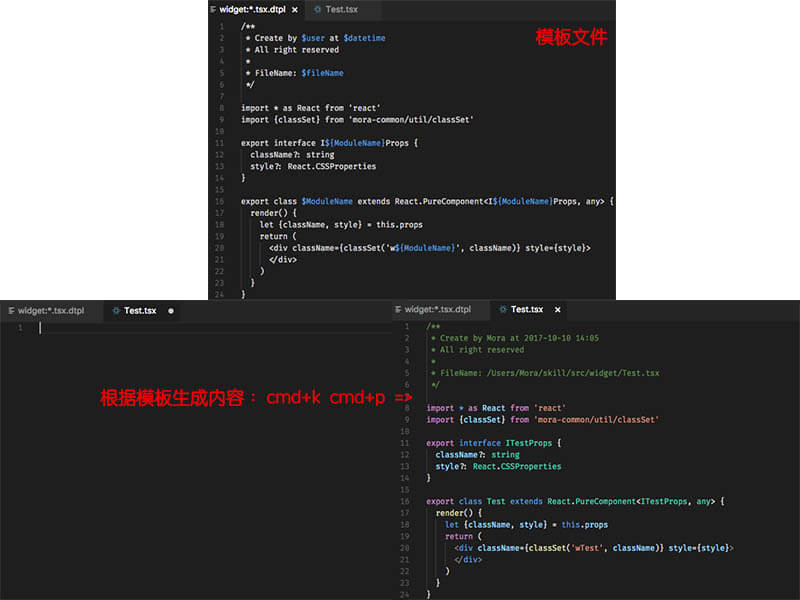
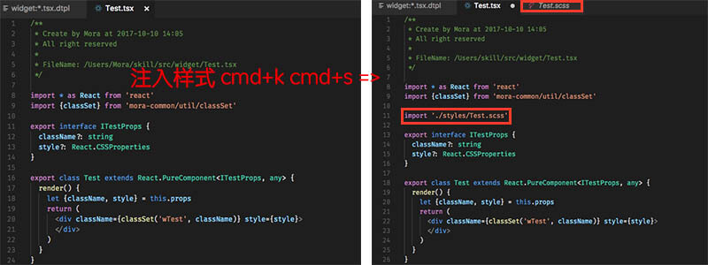

# dot-template

根据预定义的模板文件及当前环境变量来快速生成新的文件

## Features

* 模板文件匹配

  **一个项目中可以有多种不同的模板文件，但创建文件的命令只有一个（`cmd+k cmd+p`），dot-template 会如何选择模板文件呢？**

  dot-template 是根据文件的路径，用 [minimatch](https://github.com/isaacs/minimatch) 来匹配的. 比如：

  1. 根目录下只有一个 `.dtpl/*Modal.js` 的模板文件，则项目中所有以 `Modal.js` 结尾的文件都会使用此模板
  2. 根目录下有 `.dtpl/pages:*Modal.js` 和 `.dtpl/widgets:*Modal.js` 两个模板文件，则：
     - `pages` 目录下的所有以 `Modal.js` 结尾的文件会使用 `.dtpl/pages:*Modal.js` 模板
     - `widgets` 目录下的所有以 `Modal.js` 结尾的文件会使用 `.dtpl/widgets:*Modal.js` 模板
     - 其它目录下的以 `Modal.js` 结尾的文件不会使用任何模板
  3. 任何目录下都允许出现 `.dtpl` 文件夹，不一定要出现在根目录，dot-template 会自动逐渐向上查找可以匹配的模板，
    一旦匹配成功，则不继续查找了；如果找到磁盘根目录还是没找到匹配的，则 dot-template 还会继续查找 HOME 目录

  注意：
  - 因为文件路径中不允许出现 `/` 或 `\`，所以需要使用 `:` 来替代目录，当然你可以把它改成其它值，参考 [Settings](#Settings) 部分
  - 更多路径匹配规则可以参考 [minimatch](https://github.com/isaacs/minimatch)

* 模板文件（`.dtpl`）支持语法高亮

* 模板文件（`.dtpl`）支持自动补全

* 如果是前端项目，可以通过快捷键 `cmd+k cmd+s` 来快速注入样式文件的引用，并创建一个样式文件

<!--
## Requirements

If you have any requirements or dependencies, add a section describing those and how to install and configure them.
-->

## Settings

* `dot-template.templatePathSeparator`: 模板文件名称中的目录分隔符，默认值 `:`

  因为文件名称中不允许出现 `/` 或 `\` 字符，所以为了模拟路径匹配，需要使用一个替代符号

* `dot-template.templateExtension`: 模板文件的后缀名，默认值 `.dtpl`

* `dot-template.templateDirectory`: 放模板文件的文件夹的名称，默认值 `.dtpl`

* `dot-template.templateMinimatchOptions`: minimatch 的选项，用于匹配模板名称, 从而选择对应的模板，参考: https://github.com/isaacs/minimatch#options，默认值 `{"matchBase": true,"nocomment": true,"dot": true}`

* `dot-template.globalTemplateVariableFiles`: js files or ts(install `ts-node` first) files that generate custom template variables，默认值 `[]`

* `dot-template.localTemplateVariableFileName`: 模板文件目录下的自定义环境变量的文件的名称，会自动检查带 `.json`, `.js`, `.ts` 后缀的文件是否存在，存在的话就使用它，默认值 `local`

* `dot-template.importStyleTemplate`: 导入的样式文件模板（按 `cmd+k cmd+p`时生成的内容），默认值 `import './style/$rawModuleName.scss'`

<!--
## Known Issues

Calling out known issues can help limit users opening duplicate issues against your extension.
-->

## TODOS

* 支持其它 render，如 ejs

## Release Notes

### 0.0.1

Initial release
